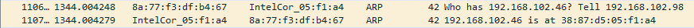
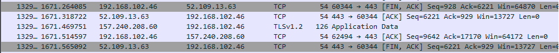
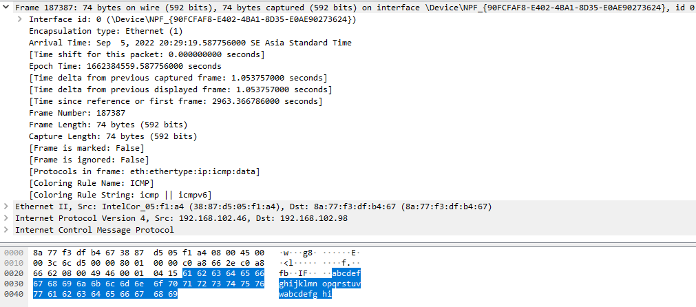
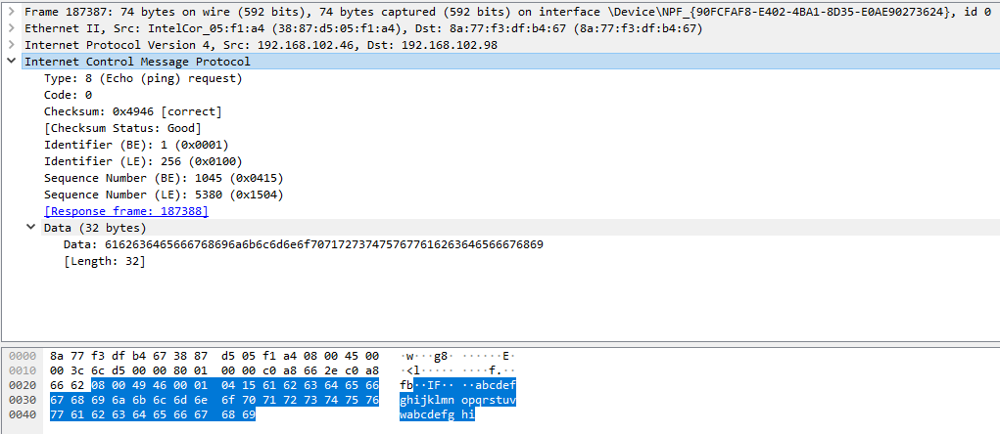

# Laporan Praktikum Konsep Jaringan

### Nama : Achmad Zahir Wajdi

### NRP : 3121600012

### Kelas : 2 D4 Teknik Informatika A

# Color Ruler yang ada di WireShark

WireShark dapat mencapture lalu lintas jaringan. Capture akan “menangkap” apa saja yang terjadi pada jaringan saat kita mengakses suatu web. Saat mencapture, wireshark akan menampikan warna. Warna tersebut dapat kita gunakan untuk mengidentifikasi jenis lalu lintas yang terjadi.
| Color in Wireshark | Packet Type |
|:------------------:|:----------------------------------------------------------------------------:|
| Light purple | TCP |
| Light blue | UDP |
| Black | Packets with errors |
| Light green | HTTP traffic |
| Light yellow | Windows-specific traffic, including Server Message Blocks (SMB) and NetBIOS |
| Dark yellow | Routing |
| Dark gray | TCP SYN, FIN and ACK traffic |
| Red | Invalid Display Filter |

beberapa warna yang berhasil saya capture antara lain:

- red color dan black dan ligth blue

  

- green color

  

- dark grey

  

# IPV4

- Untuk menganalisa paket dapat melakukan ping terlebih dahulu dengan cara :

  1. melihat default gateway pada cmd, ketik ipconfig

     

  2. lakukan ping default gateway

     

  3. cari pada source yang sama pada wireshark

     

- Setelah melakukan buka Internet Protocol untuk melakukan analisa

  

  - Version: 4 Menunjukkan versi yang digunakan adalah versi 4
  - Header length: 20 bytes Menunjukkan panjangnya header yang ada di lapisan network adalah sebesar 20 bytes
  - Source: 192.168.102.46 Destination: 192.168.102.98 Menunjukkan IP dari source yaitu 192.168.102.46 dan IP dari destination yaitu 192.168.102.98
  - Kesimpulan: Lapisan network, panjangnya header yang diberikan sebesar 20 bytes dengan IP source 192.168.102.46 dan IP destination yaitu 192.168.102.98

# Frame

1. Arrival Time: Sep 5, 2022 20:29:19.587756000 SE Asia Standard Time
   Menunjukkan waktu saat pengiriman data

2. [Time delta from previous captured frame: 1.053757000 seconds]
   [Time delta from previous displayed frame: 1.053757000 seconds]
   [Time since reference or first frame: 2963.366786000 seconds]

3. Frame Number: 187387

   Menunjukkan nomor dari frame tersebut yaitu 187387

4. Frame Length: 74 bytes (592 bits)

   Menunjukkan panjangnya frame adalah sebasar 74 bytes

5. [Protocols in frame: eth:ethertype:ip:icmp:data]
   Menunjukkan protokol-protokol apa saja yang ada di frame 187387 yaitu
   ada Ethernet, Internet Protocol (IP), Internet Control Message Protocol
   (ICMP) & Data

6. Kesimpulan:
   Lapisan ini menunjukkan apa saja yang ada dalam satu frame yaitu
   JOBSHEET TEUM
   seperti protokol-protokol yang ada di lapisan ini Ethernet, Internet
   Protocol (IP), Transmission Control Protocol (TCP), Hypertext Transfer
   Protocol (HTTP), dan data-text-lines.

# ICMP

ICMP berfungsi sebagai protokol pendukung jaringan komputer yang berfungsi untuk mengirim informasi operasional atau kendala pada jaringan-jaringan Internet. Meskipun nama ICMP sendiri berasal dari kata Internet, ICMP ini masih dapat digunakan di dalam jaringan lokal (LAN) tanpa adanya hubungan ke WAN atau Internet.

Beberapa contoh informasi yang dikirimkan melalui ICMP adalah pesan-pesan error yang sering kita temukan seperti Destination host unreachable, Destination port unreachable, Destination network unknown, dan bahkan PING (Echo reply). Karena itu, protokol ini sering digunakan di dalam program ping, traceroute, dan program-program diagnostik jaringan lainnya untuk mengecek kendala-kendala dalam sebuah jaringan komputer.

Dari tabel ICMP saat echo ping request kita mendapatkan data :

- icmp bertype 8
- code bertype 0
- algoritma checksum 0x4946
- identifier (identifikasi) sebanyak 256 bytes dan Sequence number 5380 byte.

Hasil ini merupakan request ping dari source (192.168.108.42) IP address komputer, ke dertination (192.168.108.98) IP address wifi.
