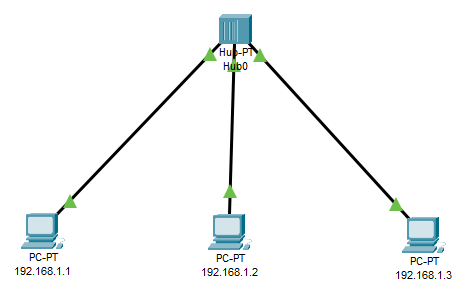

# Laporan Praktikum Konsep Jaringan

### Nama : Achmad Zahir Wajdi

### NRP : 3121600012

### Kelas : 2 D4 Teknik Informatika A

# Analisa cisco packet tracker

## Persiapan Simulasi

## Kondisi 1, PC0 mengirim ke PC1 untuk pertama kali

pada awal ping maka akan terjadi broadcast karena kondisi arp masih kosong sehingga perlu mencari ip yang dicari

## Kondisi 2, PC0 mengirim ke PC1 untuk kedua kali

setelah melakukan ping ke-1 maka arp akan tersimpan, pada ping kedua ini tidak terjadi broadcast karenan arp sudah tersimpan dan langsung menuju tujuan.

## Kondisi 3, PC1 mengirim ke PC0

pada PC1 sudah menyimpan arp PC0 saat PC0 melakukan ping PC1, sehingga saat PC1 melakukan ping pada PC0 maka tidak terjadi broadcast.
