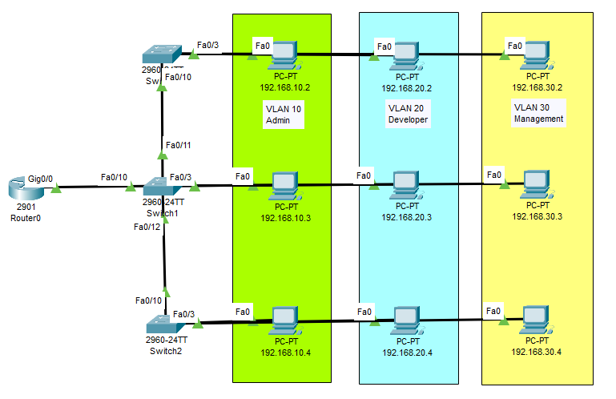

# Laporan Praktikum Konsep Jaringan

### Nama : Achmad Zahir Wajdi

### NRP : 3121600012

### Kelas : 2 D4 Teknik Informatika A

# Praktikum 5 - VLAN

## Praktikum

berikut merupakan topologi VLAN yang akan saya gunakan.

Konfigurasi IP yang akan digunakan sebagai berikut :

| Device   | Interface    | IP Address      | Gateway      |
| -------- | ------------ | --------------- | ------------ |
| Router0  | gig0/0       | 192.17.1.1/24   |              |
| pc0      | vlan10       | 192.168.10.2/24 | 192.168.10.1 |
| pc1      | vlan20       | 192.168.20.3/24 | 192.168.20.1 |
| pc2      | vlan30       | 192.168.30.4/24 | 192.168.30.1 |
| pc3      | vlan10       | 192.168.10.2/24 | 192.168.10.1 |
| pc4      | vlan20       | 192.168.20.3/24 | 192.168.20.1 |
| pc5      | vlan30       | 192.168.30.4/24 | 192.168.30.1 |
| pc6      | vlan10       | 192.168.10.2/24 | 192.168.10.1 |
| pc7      | vlan20       | 192.168.20.3/24 | 192.168.20.1 |
| pc8      | vlan30       | 192.168.30.4/24 | 192.168.30.1 |
| Switch 0 | fa0/1 vlan10 |                 |              |
|          | fa0/2 vlan20 |                 |              |
|          | fa0/3 vlan30 |                 |              |
|          | fa0/10 trunk |                 |              |
| Switch 1 | fa0/1 vlan10 |                 |              |
|          | fa0/2 vlan20 |                 |              |
|          | fa0/3 vlan30 |                 |              |
|          | fa0/10 trunk |                 |              |
|          | fa0/11 trunk |                 |              |
|          | fa0/12 trunk |                 |              |
| Switch 2 | fa0/1 vlan10 |                 |              |
|          | fa0/2 vlan20 |                 |              |
|          | fa0/3 vlan30 |                 |              |
|          | fa0/10 trunk |                 |              |

konfigursi pada switch 1 supaya dapat terhubung dengan switch 0 dan switch 2 yang terhbung juga deng router. VLAN 10 untuk admin, VLAN 20 untuk developer, dan VLAN 30 untuk Management.

konfigurasi switch 0

konfigurasi switch 1

konfigurasi switch 2

konfigurasi pada router

Testing ping PC-10.4 ke PC-10.2 dan PC-10.4 ke PC30.3

Pada testing ping diatas saat PC-10.4 ke PC-10.2 sukses dilakukan karena PC-10.4 memiliki vlan yang sama dengan PC-10.2 yaitu vlan 10, sedangkan saat melakukan ping dari PC-10.4 ke PC30.3 tidak sukses karena vlan yang digunakan berbeda PC-10.4 menggunakan vlan 10 dan PC30.3 menggunakan vlan 30 sehingga ping yang dikirim tidak akan perna sampai.
