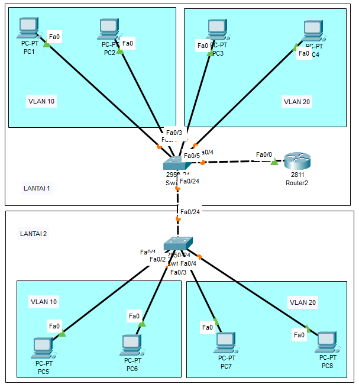
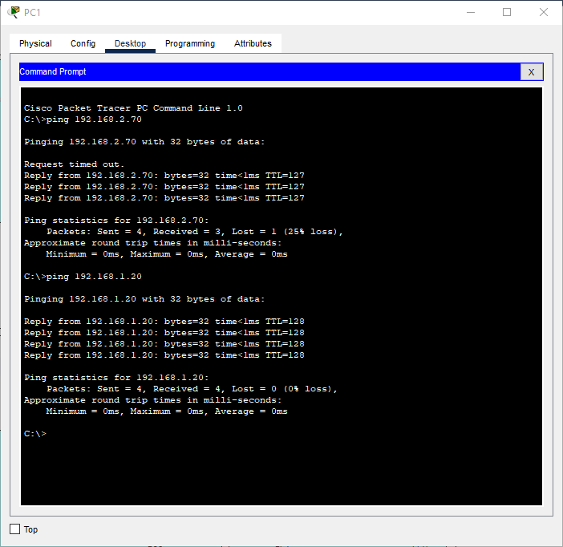

# Laporan Praktikum Konsep Jaringan

### Nama : Achmad Zahir Wajdi

### NRP : 3121600012

### Kelas : 2 D4 Teknik Informatika A

# Praktikum 6 - UTS

## Praktikum

berikut merupakan topologi VLAN yang akan saya gunakan.

Konfigurasi IP yang akan digunakan sebagai berikut :

| No  | Device name | Interface name | IP Address/subnet mask | VLAN             | Floor | Additional Information   |
| --- | ----------- | -------------- | ---------------------- | ---------------- | ----- | ------------------------ |
| 1   | Router 0    | fa0/0.10       | 192.168.1.1/24         | trunk to Switch0 | 1     | Router on stick          |
|     |             | fa0/0.20       | 192.168.2.1/24         | trunk to Switch0 | 1     | Router on stick          |
| 2   | Switch0     | fa0/1          |                        | 10               | 1     |                          |
|     |             | fa0/2          |                        | 10               | 1     |                          |
|     |             | fa0/3          |                        | 20               | 1     |                          |
|     |             | fa0/4          |                        | 20               | 1     |                          |
|     |             | fa0/5          |                        | trunk to Router0 | 1     |                          |
|     |             | fa0/24         |                        | trunk to Switch1 | 1     |                          |
| 3   | PC1         | fa0            | 192.168.1.10/24        | 10               | 1     | default gw : 192.168.1.1 |
|     | PC2         | fa0            | 192.168.1.20/24        | 10               | 1     | default gw : 192.168.1.1 |
|     | PC3         | fa0            | 192.168.2.10/24        | 20               | 1     | default gw : 192.168.2.1 |
|     | PC4         | fa0            | 192.168.2.20/24        | 20               | 1     | default gw : 192.168.2.1 |
| 4   | Switch1     | fa0/1          |                        | 10               | 2     |                          |
|     |             | fa0/2          |                        | 10               | 2     |                          |
|     |             | fa0/3          |                        | 20               | 2     |                          |
|     |             | fa0/4          |                        | 20               | 2     |                          |
|     |             | fa0/24         |                        | trunk to Switch0 | 2     |                          |
| 5   | PC5         | fa0            | 192.168.1.50/24        | 10               | 2     | default gw : 192.168.1.1 |
|     | PC6         | fa0            | 192.168.1.60/24        | 10               | 2     | default gw : 192.168.1.1 |
|     | PC7         | fa0            | 192.168.2.70/24        | 20               | 2     | default gw : 192.168.2.1 |
|     | PC8         | fa0            | 192.168.2.80/24        | 20               | 2     | default gw : 192.168.2.1 |

## Analisa

### konfigurasi yang saya berikan pada router0 :
!
interface FastEthernet0/0.10
encapsulation dot1Q 10
ip address 192.168.1.1 255.255.255.0
no shutdown
!
interface FastEthernet0/0.20
encapsulation dot1Q 20
ip address 192.168.2.1 255.255.255.0
no
!

Penjelasan :
Pada port fa0/0 sub 10 saya berikan encapsulation dengan standart dot1q dan ip address 192.168.1.1 dan pada port fa0/0 sub 20 saya berikan encapsulation dengan standart dot1q dan ip address 192.168.2.1

### konfigurasi yang saya berikan pada switch0 :
!
vlan 10
name 10
!
vlan 20
name 20
!
interface FastEthernet0/1
switchport access vlan 10
!
interface FastEthernet0/2
switchport access vlan 10
!
interface FastEthernet0/3
switchport access vlan 20
!
interface FastEthernet0/4
switchport access vlan 20
!
interface FastEthernet0/5
switchport mode trunk
!
interface FastEthernet0/24
switchport mode trunk
!

Penjelasan:
Pertama saya buat telebih dahulu vlan 10 dan vlan 20 dengan nama 10 dan 20, setelah itu saya bagi setiap pc supaya mendapat vlan yang sesuai dengan kriteria topologi. Sya juga memberikan router0 akses mode trunk
dan switch1 akses mode trunk.

### konfigurasi yang saya berikan pada switch1 :
!
interface FastEthernet0/1
switchport access vlan 10
!
interface FastEthernet0/2
switchport access vlan 10
!
interface FastEthernet0/3
switchport access vlan 20
!
interface FastEthernet0/4
switchport access vlan 20
!

Penjelasan :
Pada switch akan terjadi pembagian vlan untuk setiap PC, pada port fa0/24 sudah memiliki mode trunk karena di switch 0 sudah di mode trunk

## Hasil Konfigurasi

Setelah setiap perangkap dikonfigurasi akan menhasilkan hasil seperti berikut :

