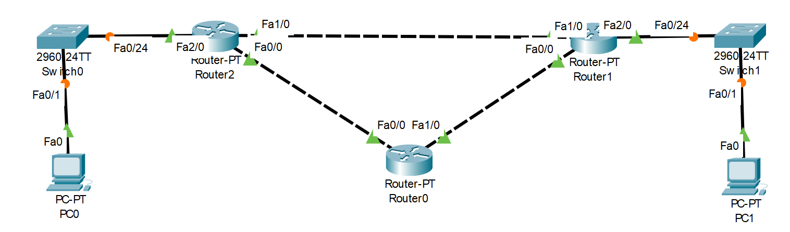
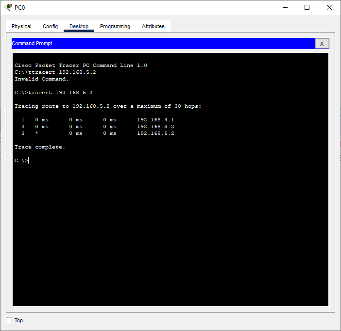

# Laporan Praktikum Konsep Jaringan

### Nama : Achmad Zahir Wajdi

### NRP : 3121600012

### Kelas : 2 D4 Teknik Informatika A

# Praktikum 9 Routing Dynamic

## Pendahuluan

Dynamic routing secara otomatis dapat memilih jalur terbaiknya tanpa meminta suatu input dari admin. Secara periodik algoritma ini akan update dan menganalisis jika terjadi perubahanpada topologinya. Protocol dalam dynamic routing ini yaitu RIP,IGRP,EIGRP,OSPF.

Dalam dynamic routing dapat diklasifikasikan lagi ke dalam 2 jenis routing protocol yaitu :

1. Protokol Distance Vector. Dalam protokol ini lebih ditekankan untuk mengetahuiarah atau jarak darirouter satu dengan router tetangga dalammatrik. Sehingga dari sumber ke tujuan diketahui berapa matrikhop yang akan ditempuh.
2. Protokol Link State. Pada protokol ini setiap router mengetahui topologi dalamseluruh jaringan, sehingga dalam protokol ini router menyediakan informasi dari jaringan yang meliputi penentuan router sebagaijalur dan status dari router tersebut.

## Percobaan

percobaan kali ini kita akan melakukan dynamic routing menggunakan protocol RIP atau Routing Information Protocol, protocol ini adalah sebuah protokol routing dinamis yang digunakan dalam jaringan LAN (Local Area Network) dan WAN (Wide Area Network). Oleh karena itu protokol ini diklasifikasikan sebagai Interior Gateway Protocol (IGP). Protokol ini menggunakan algoritma Distance-Vector Routing.

Cara kerja RIP :

1. Host mendengar pada alamat broadcast jika ada update routing dari gateway.
2. Host akan memeriksa terlebih dahulu routing table lokal jika menerima update routing .
3. Jika rute belum ada, informasi segera dimasukkan ke routing table .
4. Jika rute sudah ada, metric yang terkecil akan diambil sebagai acuan.
5. Rute melalui suatu gateway akan dihapus jika tidak ada update dari gateway tersebut dalam waktu tertentu
6. Khusus untuk gateway, RIP akan mengirimkan update routing pada alamat broadcast di setiap network yang terhubung

## Topologi

berikut merupakan topologi yang akan kita gunakan:

dari topologi diatas kita dapat membuat tabel konfigurasi seperti berikut:

| No  | Device name | Interface name | IP Address/subnet mask | Additional Information     |
| --- | ----------- | -------------- | ---------------------- | -------------------------- |
| 1   | Router 0    | fa0/0          | 192.168.2.2/24         | dest network : 192.168.2.0 |
|     |             | fa0/1          | 192.168.1.2/24         | dest network : 192.168.1.0 |
| 2   | Router 1    | fa0/0          | 192.168.1.1/24         | dest network : 192.168.1.0 |
|     |             | fa0/1          | 192.168.3.2/24         | dest network : 192.168.3.0 |
|     |             | fa0/2          | 192.168.5.1/24         | dest network : 192.168.5.0 |
| 3   | PC1         | fa0            | 192.168.5.2/24         | default gw : 192.168.5.1   |
| 4   | Router 2    | fa0/0          | 192.168.2.1/24         | dest network : 192.168.2.0 |
|     |             | fa0/1          | 192.168.3.1/24         | dest network : 192.168.3.0 |
|     |             | fa0/2          | 192.168.4.1/24         | dest network : 192.168.4.0 |
| 5   | PC0         | fa0            | 192.168.4.2/24         | default gw : 192.168.4.1   |

untuk memberikan destination network untuk routing dinamis dapat menggunakan perintah berikut :

    RIPv1
    router rip
    network "ip destination"
    network "ip destination"

    RIPv2
    router rip
    version 2
    network "ip destination"
    network "ip destination"

kita dapat melakukan trace packet dari jaringan 4.0 menuju 5.0 dengan memberikan perintah :

    tracert 192.168.5.2

pada cmd PC0

hasil dari trace packet seperti berikut:

## Time Convergency

Konvergensi adalah suatu bahasan dalam dynamic routing yang mempunyai keadaan dimana ketika semua router telah mempunyai routing tabel mereka sendiri sacara tetap dan konsisten. Jaringan yang Convergence ketika semua router telah mendapatkan hasil lengkap dan akurat mengenai informasi jaringan. Waktu convergence adalah waktu saat semua router berbagi informasi, menghitung jalur terbaik, memperbaharui Routing tabel mereka. Jaringan tidak akan berhenti beroperasi sampai semua network mendapatkan status convergence, kebanyakan jaringan mempunyai waktu yang singkat untuk mengubah statusnya menjadi konvergensi. (Graziani & Johnson, 2008).
